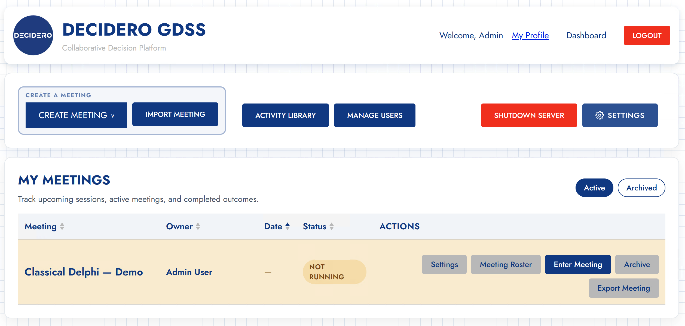
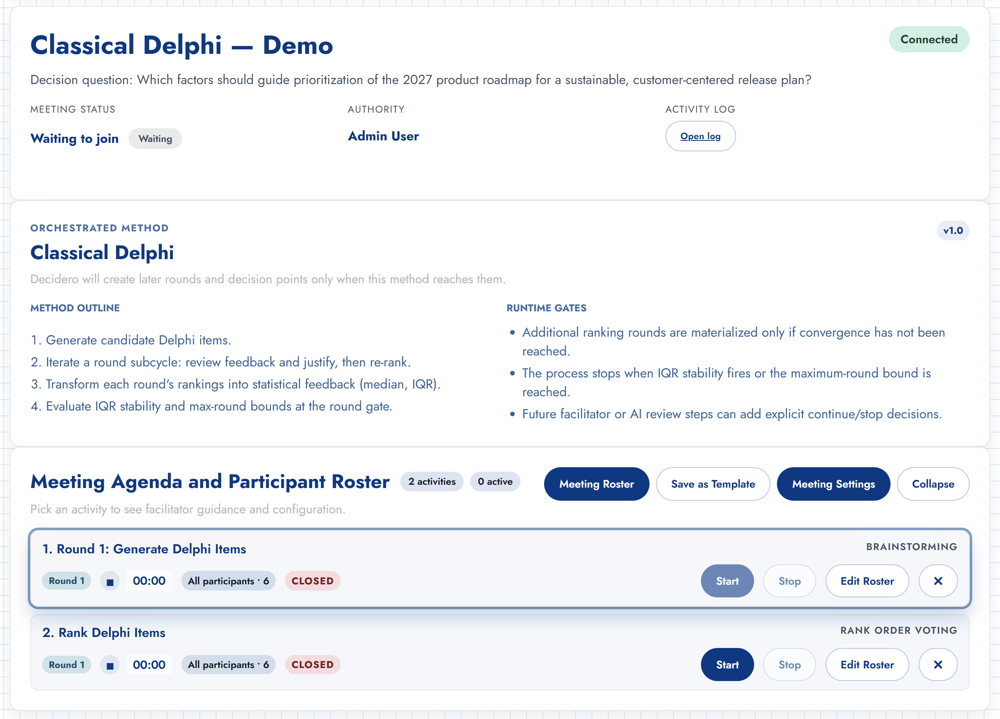
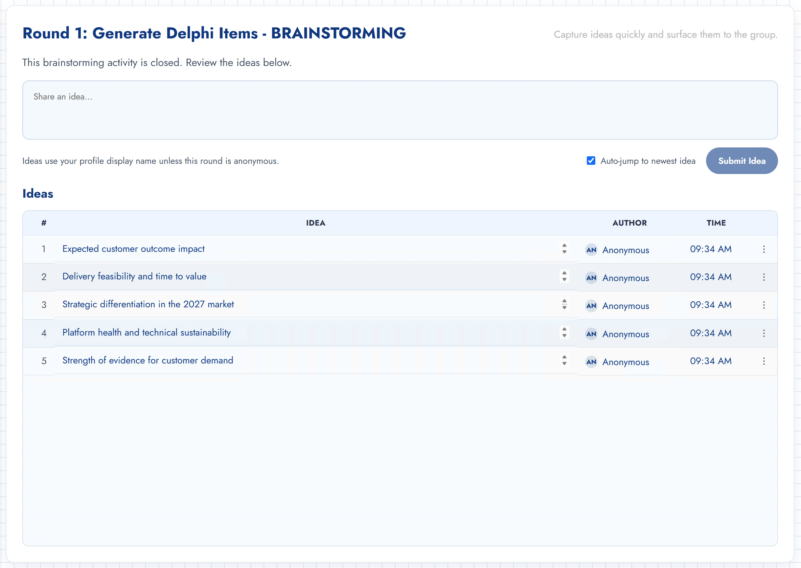
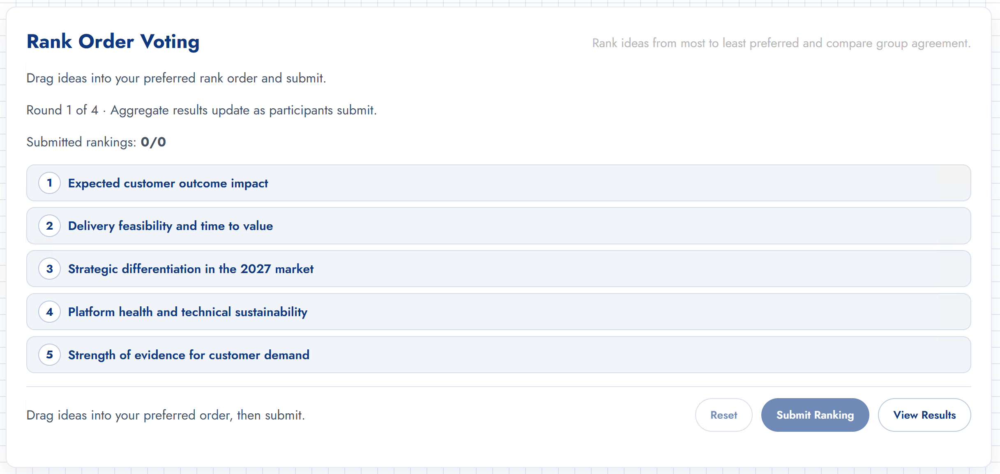
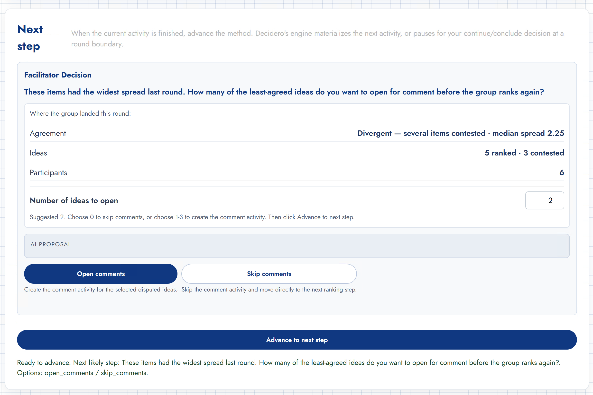
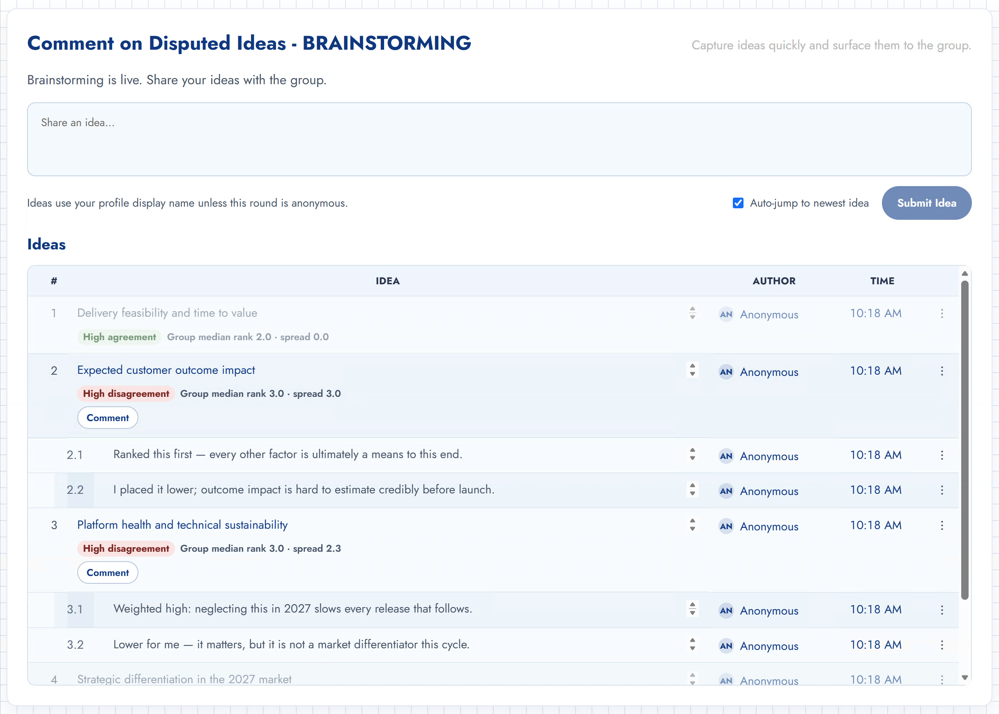
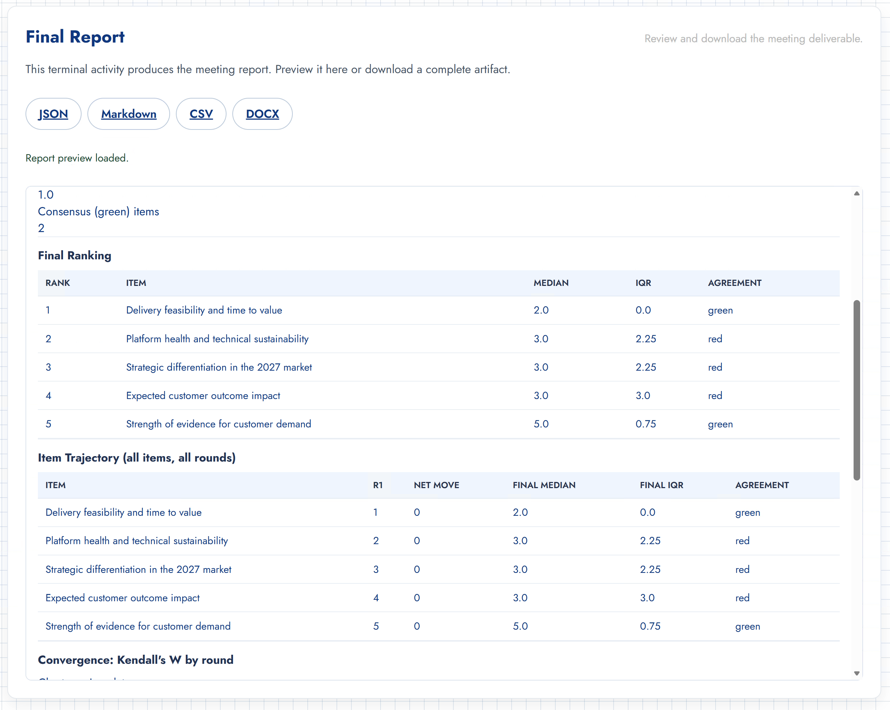

# Classical Delphi Method Demonstration

## Overview

This document is the demonstration companion and technical reference for the
executable **Classical Delphi** orchestration implemented in Decidero GDSS. It
accompanies the research paper on executable collaboration engineering submitted
to the Hawaii International Conference on System Sciences (HICSS).

The thesis demonstrated here is that a recognizable, multi-stage collaborative
method can be expressed purely as a **declarative orchestration document
(Layer 2)** executed over **generic, frozen activity plugins (Layer 1)** and
**shared runtime primitives (Layer 3)** — with **no bespoke Delphi activity code**.
The worked example: the Delphi comment step is the *ordinary brainstorming
activity configured as a comment surface*, not a purpose-built justification
activity. (The earlier `outlier_justification` activity is retained in the tree
but is **deprecated and unused** by `orchestrations/delphi.json`.)

---

## Method Specification

* **Method:** Classical Delphi (iterative consensus with controlled statistical feedback)
* **Citation:** Linstone, H. A., & Turoff, M. (Eds.). (1975). *The Delphi Method: Techniques and Applications*. Addison-Wesley.
* **Orchestration source:** [`orchestrations/delphi.json`](../orchestrations/delphi.json)
* **Canary identifier:** `Oracular Quokka`

### Process workflow (as executed by the engine)

```
Generate items ── brainstorming (anonymous)
      │
      ▼
┌─ iterate (≤ 4 rounds; converge when IQR stabilizes, ΔIQR ≤ 0.15) ─────────────┐
│   Rank items ────────────── rank_order_voting                                  │
│        │                                                                       │
│        ▼                                                                       │
│   Statistical feedback ──── delphi_statistical_aggregation                     │
│        │                    (per-item median, IQR, dispersion; agreement bands)│
│        ▼                                                                       │
│   In-round decision ─────── facilitator opens N least-agreed items, or skips   │
│        │                                                                       │
│        ▼                                                                       │
│   Comment on disputed ───── brainstorming configured as a comment surface      │
│        │                    (seeded from the ranking; only disputed items open)│
│        ▼                                                                       │
│   Round gate ───────────── continue / conclude (AI-recommended; facilitator    │
│                             decides; max-round bound is a hard backstop)       │
└────────────────────────────────────────────────────────────────────────────┘
      │
      ▼
Final Report ── ranking, per-round trajectory, Kendall's W, downloadable artifact
```

1. **Generation (Round 1).** Participants generate candidate items anonymously via the standard `brainstorming` activity.
2. **Ranking.** Items enter an `iterate` construct (`max_rounds: 4`); participants rank with `rank_order_voting`.
3. **Statistical aggregation.** Between steps the `delphi_statistical_aggregation` transform computes per-item **median rank, interquartile range (IQR), and dispersion**, and tags each item into an agreement band (green / yellow / red).
4. **In-round controlled feedback.** The engine scores item-level disagreement and recommends how many of the *least-converged* items to open for comment. The facilitator chooses the number (and may choose none). Feedback targets **items, not people**, so no participant is singled out.
5. **Comment.** The selected disputed items open for comment using the generic `brainstorming` plugin as a comment surface (seeded from the prior ranking, restricted to the selected items).
6. **Convergence & round gate.** The `iqr_stability` predicate (threshold `ΔIQR ≤ 0.15`) and the max-round bound decide whether iteration ends. At the round boundary a `continue` / `conclude` decision is offered; an AI advisor recommends and the facilitator decides, with a deterministic rule as fallback.
7. **Deliverable.** A configured terminal `report` step builds one canonical model (final ranking, per-round trajectory, Kendall's W, narrative) rendered on demand as JSON, Markdown, CSV, or DOCX.

---

## Demonstration Walkthrough

The screenshots below are from a live run of the packaged template. Because the
Delphi rounds are **anonymous**, the session is driven by a single facilitator
against a seeded six-member panel; participant identities never surface — only
the aggregate statistics do. The run is reproducible with
[`scripts/seed_delphi_demo.py`](../scripts/seed_delphi_demo.py) (see *Replication*).

### 1. The packaged method on the dashboard

The Classical Delphi meeting is created from a built-in template — a reusable,
runtime-free design. No agenda authoring is required.



### 2. The orchestrated method

Opening the meeting shows the decision question, the method outline, and the
runtime gates. The engine materializes later rounds and decision points **only
when the method reaches them** — the agenda is built one step at a time, not
pre-expanded.



### 3. Round 1 — generate items (anonymous brainstorming)

Participants contribute candidate factors anonymously through the standard
brainstorming activity.



### 4. Rank-order voting

The generated items flow into `rank_order_voting`. This is a generic activity —
nothing about it is Delphi-specific.



### 5. Statistical feedback and the in-round decision

After ranking, the engine reports **where the group landed** and recommends how
many least-agreed items to open for comment. In this run the group is
**divergent — median spread 2.25**, with **3 of 5 items contested** across the
**6 participants**, and the engine **suggests opening 2** items. The facilitator
retains authority to open more, fewer, or none.



### 6. Comment on disputed ideas

Choosing *Open comments* seeds a comment surface with the ranked items, but only
the **disputed** ones (here *Expected customer outcome impact* and *Platform
health and technical sustainability*, both flagged **high disagreement**) are
open for comment; converged items are shown for context. Participants add brief
anonymous rationales, which nest under the item they address.



### 7. The final report

Concluding at the round gate materializes the terminal report. It renders the
**final ranking** (with per-item median, IQR, and agreement band), the
**item trajectory**, and the **convergence (Kendall's W) by round**, and offers
the deliverable as **JSON, Markdown, CSV, or DOCX**.



---

## The deliverable

The report is built once from a canonical model; every rendered format derives
from the same model, so the JSON is authoritative and the run is reproducible.
A complete exported example is included at
[`delphi_demo/sample_report.md`](delphi_demo/sample_report.md). The run summarized
there (single round, five items):

| Rank | Item | Median | IQR | Agreement |
| --- | --- | --- | --- | --- |
| 1 | Delivery feasibility and time to value | 2.0 | 0.0 | green |
| 2 | Platform health and technical sustainability | 3.0 | 2.25 | red |
| 3 | Strategic differentiation in the 2027 market | 3.0 | 2.25 | red |
| 4 | Expected customer outcome impact | 3.0 | 3.0 | red |
| 5 | Strength of evidence for customer demand | 5.0 | 0.75 | green |

Run summary: **Kendall's W 0.4**, rank stability (Spearman) 1.0, 2 consensus
(green) items. The engine supports up to four rounds; additional rounds are
materialized only while the IQR-stability convergence check has not fired, and
the report's trajectory and Kendall's-W-by-round sections accumulate a point per
round.

---

## Technical architecture (layered model)

1. **Layer 1 — reusable activities**
   - `brainstorming` (`app/plugins/builtin/brainstorming/`) — used both for generation and, configured as a comment surface, for the comment step
   - `rank_order_voting` (`app/plugins/builtin/rank_order_voting/`)
   - `report` (terminal deliverable)
2. **Layer 2 — orchestration document**
   - `orchestrations/delphi.json`, validated against `docs/schemas/orchestration.schema.json` (the loader is the authoritative runtime validator)
3. **Layer 3 — runtime primitives & engine**
   - Orchestration engine: `app/services/agenda_strategy.py`
   - Convergence predicate: `iqr_stability` (`app/services/orchestration_predicates.py`)
   - Bundle transform: `delphi_statistical_aggregation` (`app/services/orchestration_transforms.py`)
   - Controlled-feedback selection: `app/services/delphi_feedback_policy.py`
   - Report model: `app/services/report_service.py`
4. **Layer 4 — data bundles**
   - Activity handoffs conform to `docs/schemas/bundle_payload.schema.json`

Method logic and control points live in the **Layer-2 document, never in the
activities or the engine**. Delphi is one data file; everything coded is generic.

---

## Replication & test execution

The deterministic execution and convergence behavior of the Delphi orchestration
are validated against synthetic cohorts:

```bash
PYTHONPATH=. ./venv/bin/pytest app/tests/test_orchestration_engine.py -k delphi -v
```

See [`docs/DELPHI_VALIDATION.md`](DELPHI_VALIDATION.md) for fixture data, IQR
regime validation, and analytical proofs.

### Reproducing the demonstration meeting

The screenshots above come from a seeded, screencast-ready meeting. To recreate
it on a local instance:

```bash
# populate a fresh, parked Classical Delphi demo (admin + 6 anonymous panelists,
# five items, and a first-round ranking with realistic disagreement)
PYTHONPATH=. ./venv/bin/python scripts/seed_delphi_demo.py --reset
```

Then start the app, sign in as the facilitator, open **Classical Delphi — Demo**,
and drive the flow: run and stop each activity, then **Advance** at each step to
reach the statistical feedback, the comment step, the round gate, and the final
report.
