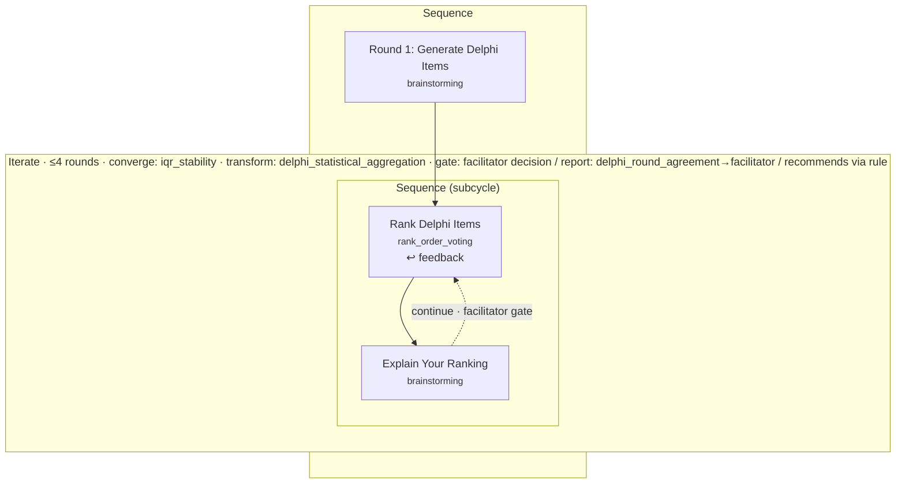

# Orchestration structure figures

These diagrams are **generated directly from the orchestration JSON** by
`scripts/export_orchestration_diagram.py` (which walks the parsed AST in
`app/services/orchestration_diagram.py`). Because they are produced from the real
document the engine runs, they cannot drift from the shipped method — a useful
property for paper figures.

Regenerate after editing a document:

```bash
python scripts/export_orchestration_diagram.py orchestrations/delphi.json
```

This writes `<stem>.mmd` (Mermaid) and `<stem>.dot` (Graphviz). Render the DOT to
a publication image with Graphviz:

```bash
dot -Tpng docs/figures/delphi.dot -o docs/figures/delphi.png   # or -Tsvg / -Tpdf
```

## Classical Delphi

The nesting in the JSON **is** the recursion; the diagram makes it visible. A top
sequence runs item generation, then an `iterate` whose body is a nested
`sequence` round subcycle: rank first, then a post-ranking justification. The
ranking carries the prior round's feedback (`↩ feedback`) and is the target of the
dashed loop-back, which is gated by the facilitator at each round boundary.



For the paper's anchor figure, pair this diagram with the corresponding
`orchestrations/delphi.json` block (the `iterate → sequence → [rank, justify]`
nesting), color-keyed node-to-JSON, so the reader sees the declared recursion and
its visual form together. See section H of
`docs/HICSS_2027_DECIDERO_ORCHESTRATOR_PAPER_OUTLINE.md`.
